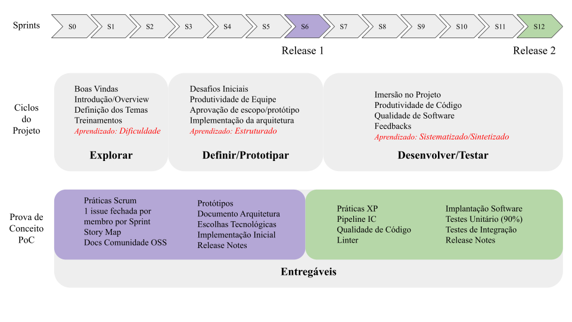

# Metodos de Desenvolvimento de Software - Plano de ensino

**DISCIPLINA**: Métodos de Desenvolvimento de Software

**CARGA HORÁRIA**: 60 horas

**PROFESSOR**: Carla Rocha

**CREDITOS**: 04 

**SEMESTRE/ANO**: 02/2023

## Objetivos da Disciplina

Métodos de desenvolvimento de software podem ser entendidos como conjuntos estruturados de boas práticas, podendo ser repetıveis durante o processo de produção do software.

 Os principais objetivos da disciplina são:

- Capacitar o aluno a compreender os diferentes métodos, ferramentas, procedimentos e complexidade do desenvolvimento de software.

- Capacitar o aluno a aplicar / adaptar processos de desenvolvimento de software a resolução de problemas de software.

 - Capacitar os estudantes para construírem sistemas complexos, apresentar as habilidades técnicas e não técnicas necessárias para  a construção de software no contexto atual da Indústria.

 ## Ementa do Programa
 
Modelos de ciclo de vida e de processos; Processo Unificado. Métodos Ágeis de desenvolvimento de software. 	Outras abordagens de desenvolvimento de software. Ferramentas.

## Metodologia de Ensino
Uma estratégia eficaz de aprendizagem deve integrar conceitos teóricos com sua aplicação prática, seguindo o princípio de "aprender fazendo". Sem prática, não há aprendizado significativo. Portanto, o processo de ensino-aprendizagem deve incluir duas etapas fundamentais: sessões de assimilação de conceitos teóricos e sessões de prática.

A disciplina usa aprendizagem por experiência, aprendizagem orientada a projetos, processo de Onboarding, e práticas de comunidades Open source para que o aluno seja ativo no seu processo de aprendizagem. A imagem abaixo mostra o ciclo da disciplina:

# Formação das equipes

A turma deve se dividir em equipes ágeis, de 5 membros por time. Serão apresentados temas de projeto e, cada grupo escolhe 3 temas na ordem de preferência. A professora  negocia e aloca os temas para o grupo, dentro das preferências. 

- A planilha para definição dos grupos e temas [aqui](https://docs.google.com/spreadsheets/d/1YR7rbIzNur_oCPjcPuMSo31IjXYsGnerDHD5KvX4070/edit?usp=sharing)

# Canais de Comunicação

A disciplina será realizada de forma presencial na sala I6. Serão disponibilizado tanto material assincrono quanto aulas sincronas. 

## Dúvidas, conversas rápidas, avisos

- Grupo do telegram - [https://t.me/+xW76puLt2pEzZWNh](https://t.me/+xW76puLt2pEzZWNh)

## Aulas assíncronas

- Vídeos disponibilizadas no youtube - [canal youtube](https://www.youtube.com/channel/UC_VXpS5GIL8NdJNkwNeAorw/videos?view_as=subscriber)
- Leituras sugeridas na sprint - disponibilizados no planejamento das aulas

# Planejamento das aulas

- O planejamento das aulas semanais, discriminando se são assíncronas ou síncronas, e qual canal vai ser atualizado no início da semana no [link](https://docs.google.com/document/d/1CI8ty75dFyb9xw1olZELF7zkANb_POgEidcXgrMdviw/edit?usp=sharing)

## Descrição do Programa

### Processos de Desenvolvimento de Software
- Modelos de Processo de Desenvolvimento de Software (ciclo de vida)
- Atividades de Processo
### Fundamentos do Extreme Programming
- O manifesto Ágil
- Os Quatro valores e as Quatro variáveis
- Praticas ageis
- O jogo do planejamento 	
- Releases Pequenas
- A metáfora
- Histórias do Usuário
- Desenho simples
- Testes (unitário, aceitação)
- Refatoração
- Programação em Pares
- Desenvolvimento Coletivo
### Fundamentos do Processo Unificado de Desenvolvimento de Software
- Conceitos
- Fases: Iniciação, Elaboração, Construção e Transição
- Disciplinas( Modelagem de Negócio, Requisitos, Análise e Desenho, Implementação, Teste, Gerenciamento de Projeto, Gerência de Configuração e Mudanças, Implantação e Ambiente)

## Avaliações e Critérios de Avaliação
A avaliação será feita por meio da avaliação individual do desempenho do aluno no ciclo de projeto:

O objetivo do Projeto simula uma situação real de desenvolvimento. Os alunos de MDS irão se concentrar na execução metodologia de desenvolvimento através da especificação de requisitos, codificação e testes. Haverá duas avaliações formais das releases a serem 
desenvolvidas.

A nota final do aluno é calculado da seguinte forma:

Nota Final = (Critério de Avaliação Coletiva) * 0,20 + (Critério de Avaliação Individual) * 0,40 + (Release 1) * 0,2  + (Release 2) * 0,2

Os critérios estão detalhados nesse [documento](./Criterios.pdf)

Para o aluno satisfazer os seguintes requisitos para obter a aprovação na disciplina:

 - Aprovação se MF >= 5,0 e se Percentual de faltas (PF) for PF <= 25%. Onde PF é dado pelo número de aulas com faltas registradas dividido pelo número de aulas ministradas.
- Reprovação se MF < 5,0ou se PF > 25%. Nessa situação o aluno será considerado reprovado por nota ou por falta.

Os criterios avaliados individualmente no projeto esta destacado na tabela abaixo

| Evento da Avaliacao Individual no projeto  |
| ------ |
| Codigo/ Entrega    |
|Documentação|
|Coerência - Documentos e Código|
|Critério Extra	|
|Histórias e Planejamento da Release				|
|Testes Automatizados e Cobertura de Código > 90%	|			
| Tracking	|			
| Wiki Atualizada	|			
| Software Implantado e Disponível para Uso	|
| PA - pareamento |
| PA - reuniao de planejamento da sprint |
| PA - planning poker |
| PA - sprint time box |
| PA - participacao nas daylies |
| PA - review com o cliente |
| PA - retrospectiva na sprint |
| PA - user stories |
| PA - risco sustentavel de trabalho |
| PA - codigo escrito com padroes |
| PA - plano de comunicacao |
| PA - comunicacao tecnica nas issues |
| PA - pull requests educativos |
| PA - praticas de comunidades de software livre|

## Avisos
- Também são considerados critérios de avaliação da participação: assiduidade; pontualidade; interesse; participação em sala.
- Os documentos referentes à disciplina, estarão disponíveis em: [https://github.com/fga-eps-mds/Qualifying-Software-Engineers-Undergraduates-in-DevOps](https://github.com/fga-eps-mds/Qualifying-Software-Engineers-Undergraduates-in-DevOps)
-  Os projetos sao avaliados continuamente
-  A cobertura de código deverá ser 90\%, excetuando a camada de apresentação
- O tamanho dos times deve respeitar o limite máximo de 6 membros.
- As atividades do projeto deverão ser organizadas por meio de issues e milestones.
- O código-fonte e demais artefatos elaborados deverão ser revisados utilizando pull/merge requests e issues.

### Datas das Releases 1 e 2

- Release 1 (major) - 9 de maio de 2023

- Release 2 (major) - 12 de Julho de 2023

## Bibliografia Basica
- (OPENACCESS) Rocha, Carla. Como Acelerar o Aprendizado e Disseminar a Cultura de Inovação Ágil - [https://rochacarla.github.io/Onboarding/](https://rochacarla.github.io/Onboarding/)
- Beck, K., Programacao Extrema (XP) Explicada, 1st ed. Bookman, 2004
- Ken Schwaber e Jeff Sutherland - O Guia Definitivo para o Scrum: As Regras do Jogo - Disponível em português em [https://scrumguides.org](https://scrumguides.org)
- Sommerville, I., Engenharia de software. 8th ed., Pearson Addison Wesley, 2007. 
- [Engenharia de Software Moderna](https://engsoftmoderna.info)
- Alves, Isaque, Rocha,Carla. Qualifying Software Engineers Undergraduates in DevOps - Challenges of introducing technical and non-technical concepts in a project-oriented course - [http://arxiv.org/abs/2102.06662](http://arxiv.org/abs/2102.06662)
- Jacobson, I., Booch G., Rumbauch J., The Unified Software Development Process, 1st ed., Addison-Wesley, 1999. 
- [EBRARY] Lano, K.,UML 2 Semantics and Applications, 1st ed., Wiley, 2009. 
- OPENACCESS [Scrum e XP direto da sTrincheiras](http://www.infoq.com/br/minibooks/scrum-xp-from-the-trenches)

## Bibliografia Complementar : 

- Pfleeger, S. L., Engenharia de software: teoria e prática. 2nd ed., Prentice Hall, 2004. 
- Pressman, R. S., Engenharia de software. 6th ed., McGraw-Hill, 2006. 
- Ambler, S., Agile Modeling: Effective Practices for eXtreme Programming and the Unified Process, 1st ed., Wiley, 2002 
- Jacobson, I., Booch G., Rumbauch J., UML: Guia do Usuário, 2nd ed., Elsevier, 2005. 
- [OPEN ACCESS] Scrum e XP direto das Trincheiras. (http://www.infoq.com/br/minibooks/scrum-xp-from-the-trenches) 

